 
 

  <picture>
    
  </picture>

## Hi there 👋

I’m **Royer Ramirez Ruiz**, a **Staff DevOps & MLOps Engineer** building and operating large-scale infrastructure for cloud, on-prem, and AI-driven systems.

I specialize in making complex platforms reliable, secure, and boring in production.

---

## 🧠 What I Work On

- ⚙️ **Cloud & On-Prem Kubernetes** — EKS, Talos (Kubernetes on Rails), multi-cluster & edge deployments  
- 🚀 **CI/CD at Scale** — Bazel, GitHub Actions (self-hosted), BuildKit (multi-arch)  
- 🤖 **AI / Robotics Platforms** — GPU orchestration, training & inference pipelines  
- 🔐 **Security & Compliance** — Zero-trust networking, mTLS, OIDC (Dex), SOC 2, ISO27001
- 📊 **Observability & Reliability** — High churn workloads, metrics, logs, and alerts  

---

## 🏗️ Systems I’ve Designed & Operated

- 🌐 **Multi-cloud + on-prem global networks** powering the factories of tomorrow, along with multi-cloud environments  
- 🧱 **Kubernetes platforms** powering AI training, inference, and edge robotics systems  
- 🔁 **Artifact, cache, and build systems** for large monorepos  
- 📦 **Secure internal registries & data pipelines** for AI/ML and factory workloads  
- 📈 **Observability stacks** built to scale  
- 🔐 **Zero-trust service-to-service architectures** for regulated environments  

---

## 🧩 Impact Areas

- 🌐 **Global Infrastructure Platforms**  
  Designed and operated multi-cloud, on-prem, and edge Kubernetes platforms supporting robotics, AI, and factory workloads.

- 🚀 **Build & Delivery Systems**  
  Built reproducible build pipelines and artifact distribution systems for large monorepos and distributed teams.

- 🤖 **AI / ML Platforms**  
  Orchestrated GPU and CPU compute for distributed training, continuous learning, and low-latency inference.

- 🔐 **Security & Networking**  
  Implemented zero-trust architectures, secure connectivity between sites, and compliance-ready infrastructure.

- 📊 **Reliability at Scale**  
  Designed observability stacks for thousands of short-lived jobs and pods, enabling fast detection and recovery.

- 🧠 **Technical Leadership**  
  Led migrations, set platform standards, and mentored engineers on systems design and operations.

---

## 🛠️ Tech Stack

---

## 🤝 Collaboration

- 💡 Open to collaborating on **AI, ML, and robotics infrastructure**
- 🌍 Always happy to connect with **platform & infrastructure engineers**
- 💬 Enjoy deep dives on Kubernetes internals, CI/CD, and production failures

---

## 📫 Let’s Connect

---

  <em>Infrastructure • Automation • Reliability</em>

