<a href="https://metrics.lecoq.io/about/royerramirez"></img></a>
<a href="https://metrics.lecoq.io/about/royerramirez"></img></a>

 
 

<picture>
  
</picture>

## Hi there! 👋

I'm **Royer Ramirez Ruiz**, a Staff DevOps & MLOps Engineer specializing in all things infrastructure.

- 🚀 I’m currently working on cloud-native projects using Kubernetes and Terraform.
- 💡  Open to collaborate on cool AI/ML projects.
- 🌍 Looking to connect with other infra nerds in the AI/ML space.
- ⚡ Support me by buying me a coffee.

---

### 📫 Let's Connect

